# 🏗️ PragatiSetu — Complete Project Architecture & Flowcharts
> **SIH 2026 | PS26130** — Unified Intelligent Industrial Approval & Compliance Platform

---

## 📌 Table of Contents

1. [System Overview — Big Picture](#1-system-overview--big-picture)
2. [Tech Stack Map](#2-tech-stack-map)
3. [Citizen / Applicant Journey Flow](#3-citizen--applicant-journey-flow)
4. [Identity & Document Onboarding Flow](#4-identity--document-onboarding-flow)
5. [KYA (Know Your Approvals) Engine Flow](#5-kya-know-your-approvals-engine-flow)
6. [Approval Graph & Workflow Orchestration](#6-approval-graph--workflow-orchestration)
7. [Document Validation & OCR Intelligence Flow](#7-document-validation--ocr-intelligence-flow)
8. [SLA Monitoring & Escalation Flow](#8-sla-monitoring--escalation-flow)
9. [Inspection Management Flow (Inspector App)](#9-inspection-management-flow-inspector-app)
10. [Cryptographic Ledger — Audit & Tamper-Evident Chain](#10-cryptographic-ledger--audit--tamper-evident-chain)
11. [Admin Panel Workflows](#11-admin-panel-workflows)
12. [Regulatory Rule Versioning Flow](#12-regulatory-rule-versioning-flow)
13. [Backend API Architecture](#13-backend-api-architecture)
14. [Database & Storage Architecture](#14-database--storage-architecture)
15. [Security & RBAC Flow](#15-security--rbac-flow)
16. [Planned Backend Implementations](#16-planned-backend-implementations)

---

## 1. System Overview — Big Picture

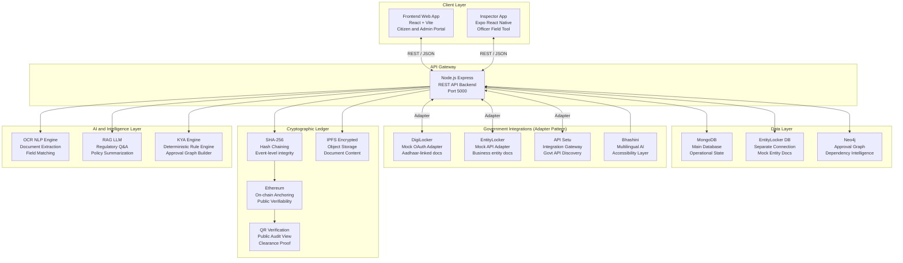

---

## 2. Tech Stack Map

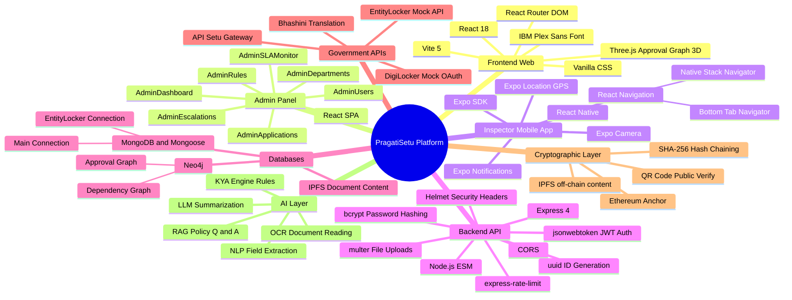

---

## 3. Citizen / Applicant Journey Flow

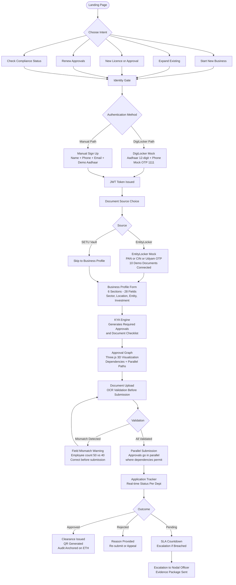

---

## 4. Identity & Document Onboarding Flow

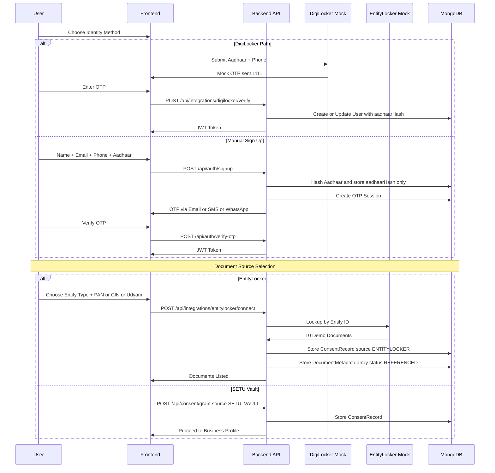

---

## 5. KYA (Know Your Approvals) Engine Flow

```mermaid
flowchart LR
    A["Business Profile\nComplete 28 Fields"] --> B["KYA Engine\nDeterministic Rule Processor"]

    subgraph INPUTS["Profile Inputs"]
        I1["Sector\nManufacturing IT Agro"]
        I2["Location\nDistrict MIDC Urban Rural"]
        I3["Investment Size\nMicro Small Medium Large"]
        I4["Employee Count"]
        I5["Env Category\nWhite Green Orange Red"]
        I6["Hazardous Material\nYes or No"]
        I7["Entity Type\nProprietorship LLP Pvt Ltd"]
        I8["Land Type\nOwned Leased MIDC"]
    end

    INPUTS --> B

    subgraph RULES["Rule Database Neo4j"]
        R1["Central Approvals\nFactory Licence Fire NOC"]
        R2["State Approvals\nMaharashtra specific"]
        R3["Local Body Clearances\nMunicipal Gram Panchayat"]
        R4["Environmental Clearances\nMPCB MoEFCC"]
        R5["Sector Specific Licences\nFSSAI Drug Licence"]
        R6["Labour Compliances\nESI PF Shops Act"]
    end

    RULES --> B

    B --> C["Approval Graph\nDependency-aware DAG"]

    subgraph OUTPUTS["KYA Outputs"]
        O1["Required Approvals List\nWith Jurisdictions"]
        O2["Required Documents Checklist\nPer Approval"]
        O3["Dependency Graph\nA must complete before B"]
        O4["Parallel Paths Identified\nC and D can proceed together"]
        O5["Estimated Timelines\nSLA per department"]
        O6["Fee Estimates\nWhere data available"]
        O7["Inspection Requirements\nWhich depts need site visit"]
    end

    C --> OUTPUTS

    NOTE["RAG or LLM Role: Explains and Summarizes ONLY\nCANNOT activate or override legal requirements\nInsufficient info means system says so explicitly"]
    B --- NOTE
```

---

## 6. Approval Graph & Workflow Orchestration

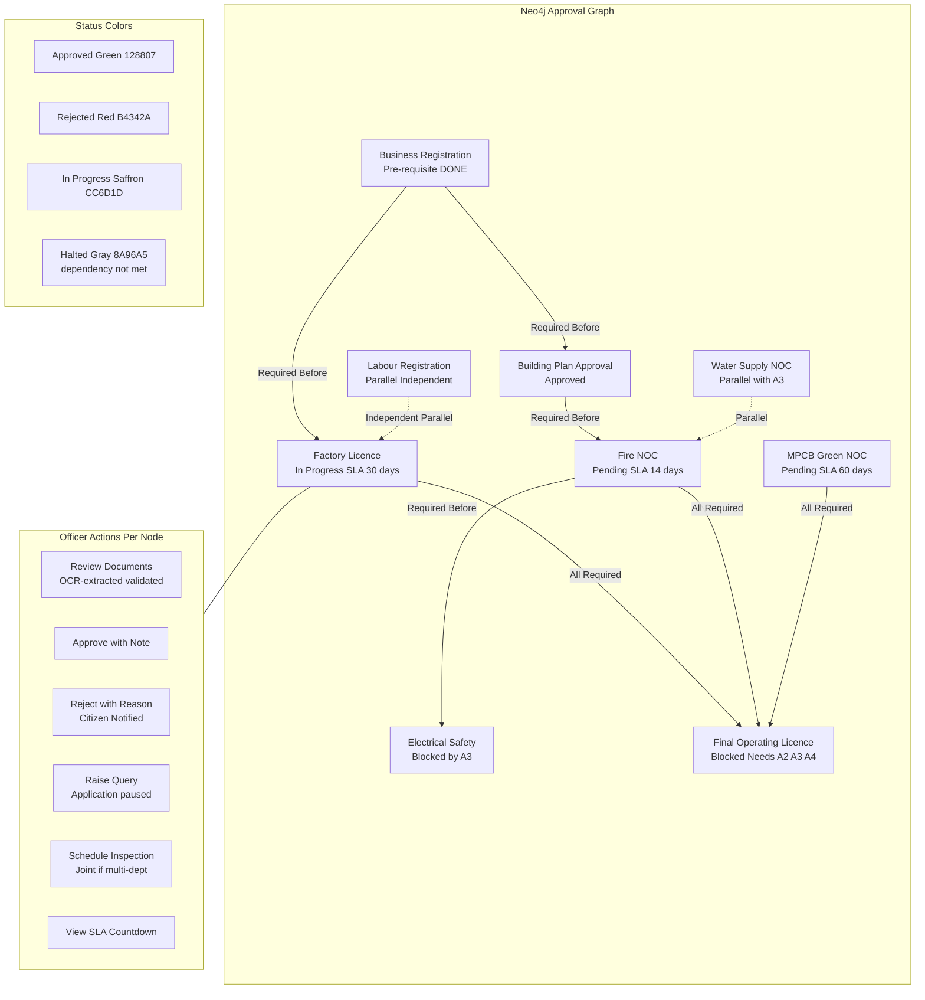

---

## 7. Document Validation & OCR Intelligence Flow

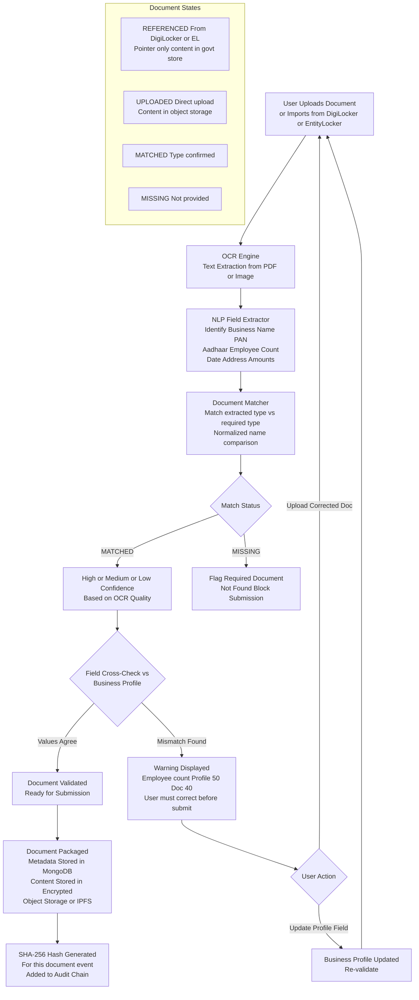

---

## 8. SLA Monitoring & Escalation Flow

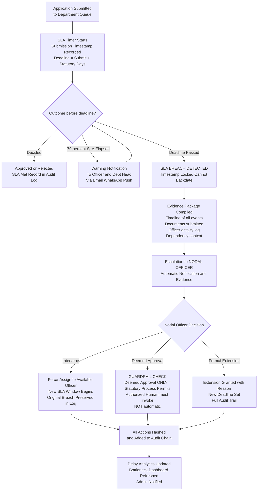

---

## 9. Inspection Management Flow (Inspector App)

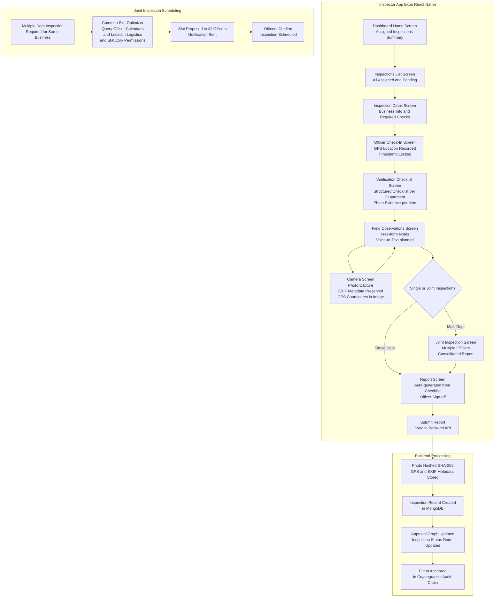

---

## 10. Cryptographic Ledger — Audit & Tamper-Evident Chain

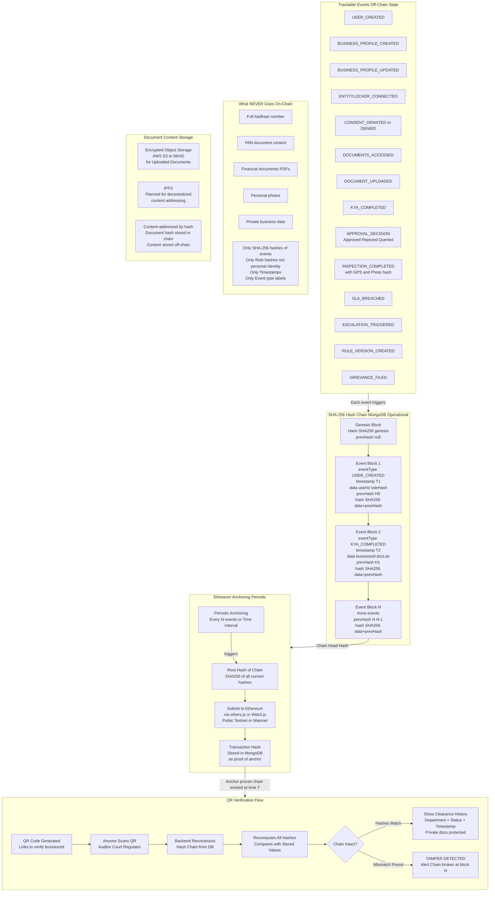

---

## 11. Admin Panel Workflows

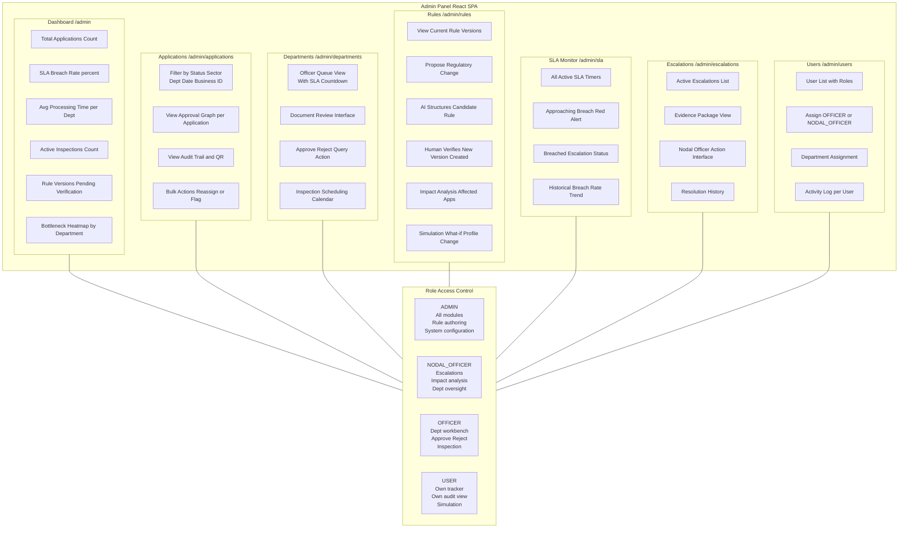

---

## 12. Regulatory Rule Versioning Flow

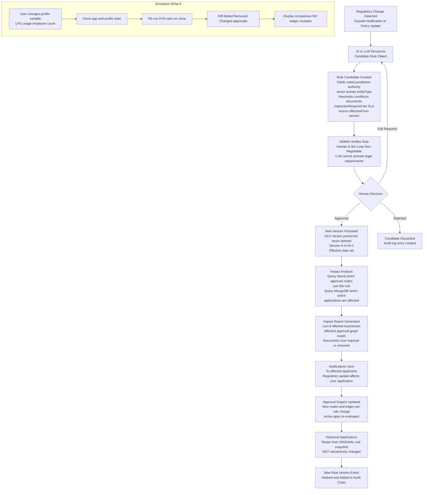

---

## 13. Backend API Architecture

```mermaid
graph LR
    subgraph ROUTES["Express Routes"]
        R1["/api/auth\nauthRoutes.js\nPOST signup verify-otp signin"]
        R2["/api/business-profile\nbusinessProfileRoutes.js\nPOST GET PUT"]
        R3["/api/integrations/digilocker\ndigilockerRoutes.js\nPOST connect verify-otp\nGET documents"]
        R4["/api/integrations/entitylocker\nentitylockerRoutes.js\nPOST connect\nGET documents"]
        R5["/api/kya\nkyaRoutes.js\nPOST run\nGET result id"]
        R6["/api/consent\nconsentRoutes.js\nPOST grant\nGET status"]
        R7["/api/documents\ndocumentsRoutes.js\nPOST upload\nGET list\nPOST match"]
        R8["/api misc\nmiscRoutes.js\nGET dashboard notifications\nGET incentives\nPOST rag/ask"]
    end

    subgraph MW["Middleware Stack"]
        M1["helmet Security Headers"]
        M2["cors Cross-Origin Config"]
        M3["express.json 2mb Request Parsing"]
        M4["auth.js JWT Verification\nRole Guard"]
        M5["express-rate-limit DDoS Protection"]
        M6["errorHandler.js\nCentralized Error Response"]
    end

    subgraph CTRL["Controllers"]
        C1["authController.js\nSignup OTP Signin\nbcrypt + JWT"]
        C2["businessProfileController.js\nCRUD Profile"]
        C3["digilockerController.js\nMock OAuth Flow"]
        C4["entitylockerController.js\nMock Entity Lookup"]
        C5["kyaController.js\nTrigger KYA Engine"]
        C6["consentController.js\nConsent CRUD"]
        C7["documentsController.js\nUpload Match List"]
        C8["miscController.js\nDashboard Notifications\nIncentives RAG Q&A"]
    end

    subgraph SVC["Services"]
        S1["digilocker\nMock OAuth Adapter"]
        S2["entitylocker\nMock Entity Adapter"]
        S3["kya\nRule Engine Logic"]
        S4["documents\nOCR + Matcher"]
        S5["notifications\nEmail SMS Push"]
        S6["audit\nHash Chain Logger"]
    end

    ROUTES --> MW --> CTRL --> SVC
```

---

## 14. Database & Storage Architecture

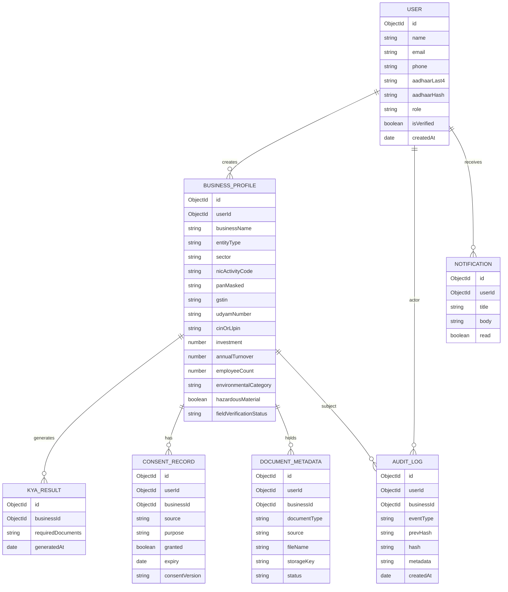

---

## 15. Security & RBAC Flow

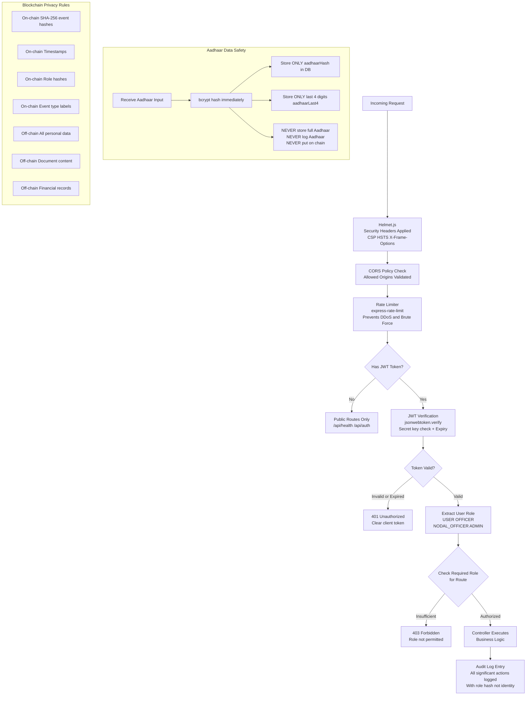

---

## 16. Planned Backend Implementations

```mermaid
flowchart TD
    subgraph PHASE1["Phase 1 Core Implemented"]
        P1_1["Auth OTP Signup Login\nbcrypt + JWT"]
        P1_2["Business Profile CRUD\nMongoDB Mongoose"]
        P1_3["KYA Engine Deterministic\nRule-based checklist generation"]
        P1_4["DigiLocker Mock Adapter\nOAuth simulation"]
        P1_5["EntityLocker Mock Adapter\nEntity document lookup"]
        P1_6["Consent Management\nConsentRecord model"]
        P1_7["Document Metadata\nUpload and Referenced tracking"]
        P1_8["Audit Log\nEvent-level logging in MongoDB"]
        P1_9["Notifications\nIn-app notification model"]
        P1_10["Incentives Matcher\nProfile-driven scheme matching"]
    end

    subgraph PHASE2["Phase 2 Intelligence Planned"]
        P2_1["OCR Integration\nTesseract.js or Google Vision API\nDocument text extraction"]
        P2_2["NLP Field Extractor\nExtract business name PAN\nemployee count from doc text"]
        P2_3["Document Matcher v2\nConfidence scoring\nMismatch detection with field diff"]
        P2_4["RAG Endpoint POST /api/rag/ask\nLLM + regulatory knowledge base\nPolicy Q&A with source attribution"]
        P2_5["Approval Graph in Neo4j\nDAG creation from KYA output\nCypher queries for dependency resolution"]
        P2_6["Joint Inspection Scheduler\nCommon slot optimizer\nacross officers and departments"]
    end

    subgraph PHASE3["Phase 3 Cryptographic Ledger Planned"]
        P3_1["SHA-256 Hash Chaining\nEach AuditLog event\nhash equals SHA256 data + prevHash"]
        P3_2["Chain Verification API\nGET /api/audit/verify businessId\nRecompute and compare all hashes"]
        P3_3["Ethereum Anchoring Service\nethers.js or Web3.js\nPeriodic root hash submission\nto public testnet Sepolia"]
        P3_4["QR Code Generation\nPOST /api/audit/generate-qr\nLinks to public clearance view"]
        P3_5["Public QR Verification Page\nGET /verify businessId\nTamper-evident clearance history"]
        P3_6["IPFS Integration\nDocument content addressing\nContent hash stored on-chain"]
    end

    subgraph PHASE4["Phase 4 Workflow Engine Planned"]
        P4_1["SLA Engine\nCron-based timer monitoring\nAutomatic escalation trigger"]
        P4_2["Escalation Service\nEvidence package builder\nNotification to Nodal Officer"]
        P4_3["Regulatory Rule Versioning API\nPOST /api/admin/rules\nVersion history preserved in DB"]
        P4_4["Impact Analysis Engine\nNeo4j + MongoDB cross-query\nAffected applications per rule change"]
        P4_5["Simulation Engine What-If\nClone profile state\nRe-run KYA and diff output"]
        P4_6["Grievance Linkage\nContextual grievance to application\nstage + department + SLA"]
    end

    subgraph PHASE5["Phase 5 Production Integrations Future"]
        P5_1["Real DigiLocker Integration\nReplace mock with production OAuth 2.0\nNSDL DigiLocker API"]
        P5_2["Real EntityLocker Integration\nReplace mock with production API\nMCA21 or NeSL connector"]
        P5_3["Bhashini API\nMultilingual UI and notifications\nRegional language support"]
        P5_4["WhatsApp Business API\nOTP + Notification delivery\nCitizen communication"]
        P5_5["DPDP Act Compliance Layer\nData minimization enforcer\nConsent lifecycle manager\nRight-to-erasure handler"]
        P5_6["Fee Payment Gateway\nRazorpay or PayGov integration\nFee collection per approval"]
    end

    PHASE1 --> PHASE2 --> PHASE3 --> PHASE4 --> PHASE5
```

---

## Complete Platform Summary

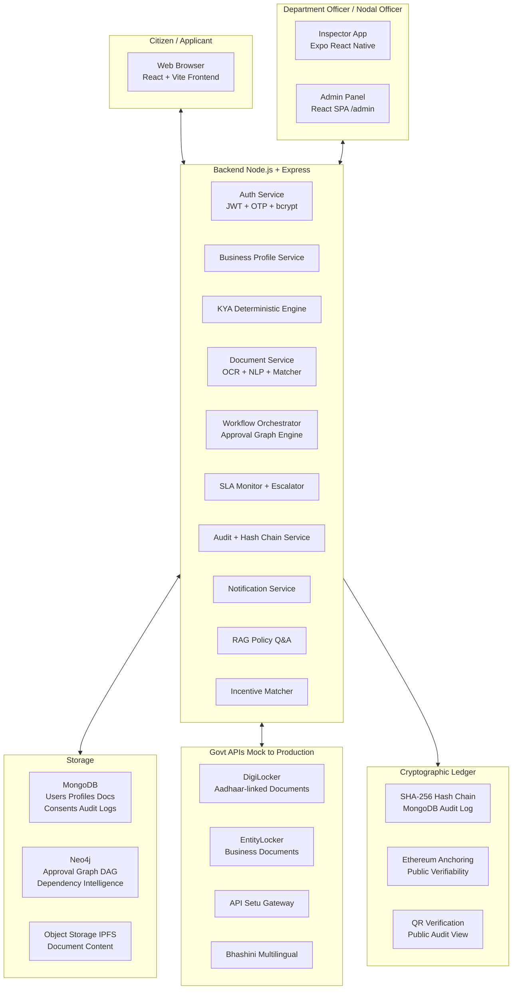

---

> **Document Version**: 1.0
> **Project**: SIH 2026 PS26130 PragatiSetu
> **Generated**: September 2026
> **Stack**: React + Vite, Node.js Express, MongoDB, Neo4j, Ethereum, Expo React Native
> **Security**: SHA-256 Hash Chain, JWT, bcrypt, RBAC, DPDP Act compliance planned
